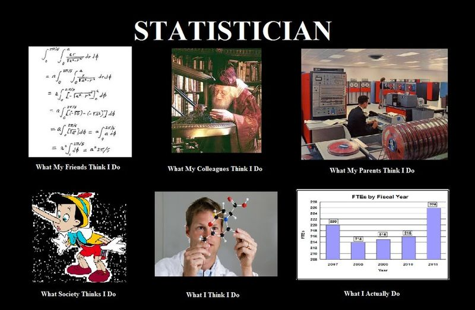
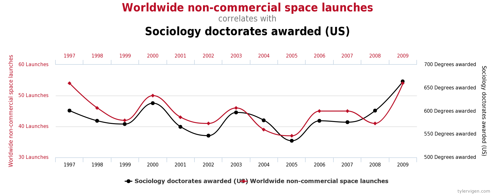
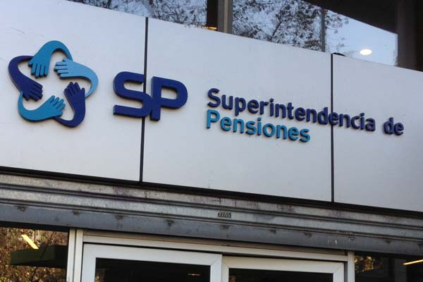
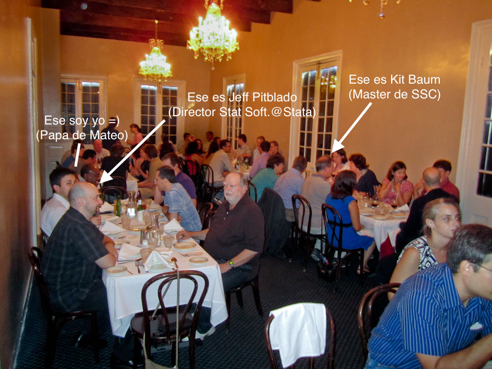
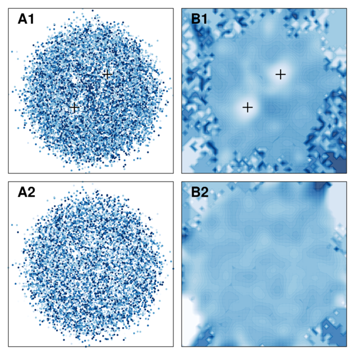
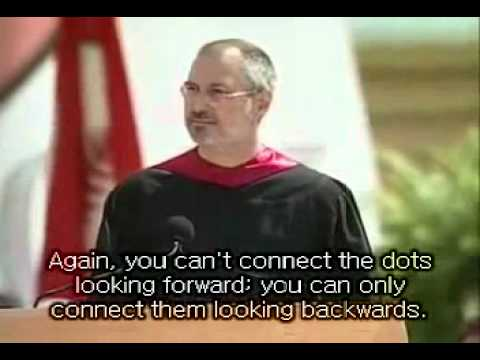

# Overview {.slidy}

<!--
- No les ensañaré codigo (hay mejores que yo en eso)
- Les contaré mi experiencia en el mundo de los datos... más aún, en el mundo
  de Data Science.
- Preguntas... no se las aguanten!
-->

</img>

_Data Scientist_ según [Drew Conway](http://drewconway.com/zia/2013/3/26/the-data-science-venn-diagram)

<!--
- Cientista politico de NYU (no como el tipico)
- Desarrollo el famoso diagrama de venn del cientifico de datos
- Ojo con Danger zone... en lo personal yo estoy en la parte mas tradicional...
  pero ojo, que, para los mas perdidos, esta Comp Soc Science! (Eso es otra historia)
-->

# Hacking skills 1: Aprende a guardar datos

</img>

> - __Problema__ Un proceso burocrático (repetitivo) y mucha info desperdiciada.
> - __Solución__ Microsoft Access (almacenar y generar docs auto)... y [MS Visio](ori.pdf)!

<!--
- Llegando al mineduc (2009): Mi primera practica, conoci a Rodrigo Fabrega
- Empresario con vocacion publica fue mi primer jefe serio
- Mi trabajo... no era muy claro (nunca lo ha sido =P), pero hice de todo
  (incluyendo ser secretario por 1 semana mientras las secretarias se tomaron vacaciones)
- De esa pega arme mi primer sistema SBDR: MS Access para procesos comision al extranjero
  una de mis primeros acercamientos a programar (macros)
- Que hice con esos datos? Bueno, almacenarlos y despues armar mi primera vis
  usando MS Visio!: Si bien estoy seguro no es lo mas sexy que hayan visto,
  si lo fue para varios en el ministerio (incluyendo la ministra)
- Algo importante: Todos entendieron el mensaje (de los 80 dias, 30 estaban en los abogados de la ministra...)
- Primer y ultimo intento de armar un sistema de interfaz grafica...
-->

# Hacking skills 2: Aprende un lenguaje de verdad


<!--
- Si bien los programas WYSIWYG  son bonitos, como visio, Excel es muy popular
  y a veces util, llega un momento en el que no puedes avanzar mas.
- Así seguí el consejo de mi profesor y amigo Jorge Fabrega.
  "Tenemos que aprender R... (2010)".
-->

-------

Pues en excel nunca podrás hacer esto!

</img>

<!--  -->

Codigo de fuente: [useRchile](http://files.meetup.com/6789812/clase1_caos_determinista.zip) en Meetup

<!--
- Sorry, pero queria mostrar esto y no sabia donde ponerlo =P
- Así inicie mi camino a R.
-->

# Hacking Skills 3: Aprende a leer (y escribir) datos

<iframe width="560px" height="315px" src="https://www.youtube.com/embed/6H0veEmTgP0" frameborder="0" allowfullscreen></iframe>

Ver el paquete [rgexf](https://CRAN.R-project.org/package=rgexf) para generar
archivos GEXF (Graph Exchange XML Format) (15K descargas)

<!--
- Mientras me adentraba a R, me tope con Gephi: The photoshop of graphs
- Luego de muchas horas luchando para preparar los datos para ser usados en gephi
  descubri que tenia un formato nativo basado en XML, GEXF (XML)
- Eso inspiro el paquete rgexf (en R). (ojo que dije paquete y no libreria!)
- Como resultado aca tengo este bonito video de la evolucion academica en chile
- Aprender a escribir es importante!
- Luego hicimos lo mismo con la API de twitter... hasta ahora un skill mas que util!
-->

# Hacking Skills 3: Aprende a leer (y escribir) datos (cont.)

<iframe width="800px" height="500px" frameborder="0" scrolling="no" marginwidth="0" marginheight="0" src="https://www.google.com/publicdata/embed?ds=lt98u9rd734rn_&amp;ctype=b&amp;strail=true&amp;bcs=d&amp;nselm=s&amp;met_y=porc_pob_pobre&amp;scale_y=lin&amp;ind_y=false&amp;met_x=prom_de_escolaridad&amp;scale_x=lin&amp;ind_x=false&amp;met_s=porc_hogares_con_computador&amp;scale_s=lin&amp;ind_s=false&amp;idim=region:II:I:III:IV:V:VI:VIII:VII:IX:XIV:X:XI:XII:RM&amp;ifdim=region&amp;tunit=Y&amp;pit=1257148800000&amp;hl=es&amp;dl=es&amp;ind=false&amp;icfg=lt98u9rd734rn_%253A51%253Aregion%26%26II:::2009%7Clt98u9rd734rn_%253A51%253Aregion%26%26I:::2009%7Clt98u9rd734rn_%253A51%253Aregion%26%26III:::2009%7Clt98u9rd734rn_%253A51%253Aregion%26%26IV:::2009%7Clt98u9rd734rn_%253A51%253Aregion%26%26V:::2009%7Clt98u9rd734rn_%253A51%253Aregion%26%26VI:::2009%7Clt98u9rd734rn_%253A51%253Aregion%26%26VIII:::2009%7Clt98u9rd734rn_%253A51%253Aregion%26%26VII:::2009%7Clt98u9rd734rn_%253A51%253Aregion%26%26IX:::2009%7Clt98u9rd734rn_%253A51%253Aregion%26%26XIV:::2009%7Clt98u9rd734rn_%253A51%253Aregion%26%26X:::2009%7Clt98u9rd734rn_%253A51%253Aregion%26%26XI:::2009%7Clt98u9rd734rn_%253A51%253Aregion%26%26XII:::2009%7Clt98u9rd734rn_%253A51%253Aregion%26%26RM:::2009&amp;iconSize=0.5"></iframe>

(ver codigo [aquí](https://sites.google.com/site/datamideplan/home/codigo-de-fuente))

Puede ser replicado con [googlePublicData](https://CRAN.R-project.org/package=googlePublicData) (10K descargas).

<!--
- XML es muy importante... o al menos eso creo yo
- Muy usado, ayuda a webscrapping
- Saber XML, regex (por ejemplo), y otros puede ser muy util!
- Esto durante mi pasada por MIDEPLAN (ahora MDS).
- El DSPL maker (como le puse yo, fue con Access, SQL y regex), me ahorro escribir~800
  lineas de codigo... eso inspiro googlePublicData. Paquete de R que lee los archivos
  de datos, analiza y genera el codigo DSPL automagicamente...
- Aca una animacion de la CASEN dinamica usando Google Public Data Explorer.
-->

# Hacking Skills (bonus track): No seas tan "hacker"

</img>

<!-- - Durante el siguiente anio trabaje mucho con access, y visio, hasta que un dia -->
<!--   mientras estaba intentaba descargar el crack de MS Visio en el computador de mi jefe -->
<!--   recibi una llamada de la Segpres... busted! -->

# Math and Statistical Knowledge 1: Aprende estadistica (de verdad)



<!--
- No sirve de nada saber R si no puedes interpretar
- Entender que no todo es OLS es importante
-->

# Math and Statistical Knowledge 2: Aprende estadistica (de verdad... por favor)

</img>

<!--
- No es necesario que sean PhD, pero si van a sacar conclusiones
  y son talentosos haciendo viz, sean responsables tambien...
- Un punto aca. Yo soy economista, y como tal mi objetivo es hacer inferencia
  (a proposito), eso es algo que creo yo limita algo a la corriente ML
- Si quieres predecir usa ML, si quieres destinar $$$ a un programa de marketing
  o a una politica de gobierno usa Econometria (inferencia).
-->

Correlación != Causalidad

# Math and Statistical Knowledge 3: Piensa _dentro_ de la caja$^1$

</img>

- __Problema__: Bases de datos 300>observaciones + MCMC grandes
- __Solución__: "[parallel](http://github.com/gvegayon/parallel): Stata module for parallel computing"

$^1$: Blog de Dirk Eddelbuettel, [Thinking Inside the Box](http://dirk.eddelbuettel.com/blog/) (autor de Rcpp+friends)

<!--
- Tambien es bueno entender stats por que puedes acortar camino...
- 
- Por ejemplo en la SP. Trabajaba a diario con millones de datos (literalmente),
  en unos servidores con Stata y con 16 procesadores (que no esta mal)
  pero todos usaban solo 1!.
- El problema fue peor cuando tuvimos que implementar un MC para pensiones
  tardaba 1 semana en correr...
- Esto inspiro parallel: dividir y conquistar.
-->

# Math and Statistical Knowledge 3: Piensa _dentro_ de la caja

No sólo estadística, también:

- Expresiones regulares para I/O
- Shell-scripting para interactuar con OS
- Saber algo más de pseudo-RNG
- Mata (mata, mata...): Lenguaje Matricial en Stata

También:

- Mucho `LaTeX` durante todo el proceso: sobre todo para
  reporteria automática (nunca esta demas... a pesar de markdown).


<!--
- Algo importante, no solo use estadistica aca, para
- Todo el conocimiento se va acumulando...
- Sobre todo LaTeX, de verdad es muy cotizado (no todo el mundo quiere)
  paginas webs interactivas (por mas interesantes que sean!). Ademas es
  mas flexible.

- Mata: Mi primer coqueteo con C-like
-->

----

parallel en Stata Conference 2012 (Nueva Orleans)

</img>

<!--
- Y asi fue como parti mostrando mi trabajo fuera del pais
- Perdon por la foto, pero es la mejor que tengo! (alguien ha oido de esos amigos??)
-->

# Substantive Expertise 1: Todo suma (APIs+regex+stats+viz)

<iframe src="http://cana.usc.edu/vegayon/twitter/report_example.html" width="800"
height="600"></iframe>

Projecto [twitterreport](http://github.com/gvegayon/twitterreport) (en github: vegayon/twitterreport)

<!--
- Hack twitter, uso de C++ para implementar estadisticas algo mas avanzadas
- Y presentar los datos de una forma 
-->

# Substantive Expertise 2: Todo suma (Rcpp+Big data+R graphics:: :])

Presentacion del paquete <a href="http://github.com/USCCANA/netdiffuseR" target="_blank">netdiffuseR</a> (1.3K descargas) en useR2016!

<iframe src="https://channel9.msdn.com/Events/useR-international-R-User-conference/useR2016/Network-Diffusion-of-Innovations-in-R-Introducing-netdiffuseR/player" width="900px" height="540" allowFullScreen frameBorder="0"></iframe>

# Substantive Expertise 3: Todo suma (smooth scatterplots+stats)



Fuente: Vega, George G. & Valente, Thomas W., _Visualizing Large Annotated Graph as Heatmaps_ (working paper)

----------

Conectando los puntos...



Ver video [aquí](https://www.youtube.com/watch?v=D1R-jKKp3NA)

<!--
- Motivado mas bien por el lado academico, comence a usar R para armar
  graficos y analizar datos (nada muy sofisticado), pero los graficos
  se veian muy bonitos
- Ademas de adentre en el mundo de LaTeX
-->

# Recapitulando

__Hacking skills__:

> - Aprende a guardar datos
> - Aprende un lenguaje de programación
> - Aprende a leer (y escribir datos)
> - No seas tan _hacker_

__Math and Statistical Knowledge__:

> - Aprende estadística (de verdad)
> - Aprende estadística (de verdad) ... por favor!
> - Piensa _dentro_ de la caja

__Substantive Expertise__:

> - Todo suma (x3)

# Algunos consejos finales

> - Se curioso: Nunca sabes donde te puede llevar el conocimiento nuevo
> - Ten iniciativa: Por que alguien no lo este haciendo no significa que no sea interesante/útil
> - Obsesionate con un problema!: En mi caso, ha sido cuando he aprendido más 

# Algunos consejos finales (cont.)

Pero no te obsesiones tanto...

```
// 
// Dear maintainer:
// 
// Once you are done trying to 'optimize' this routine,
// and have realized what a terrible mistake that was,
// please increment the following counter as a warning
// to the next guy:
// 
// total_hours_wasted_here = 42
// 
```

Publicado en [Stackoverflow#18416](http://stackoverflow.com/questions/184618/what-is-the-best-comment-in-source-code-you-have-ever-encountered)

# Algunos consejos finales (cont.)

> - Más práctico: No trates de ser poliglota en programación
> - Y por último... Se riguroso (y responsable) con los datos (evita la "danger zone" de Drew). Como el tio Ben dice: "_Un gran poder conlleva una gran responsabilidad_"

# Gracias! {.large}

Preguntas?

George G. Vega Yon <br> http://cana.usc.edu/vegayon<br> <a href="http://twitter.com/gvegayon" target="_blank">@gvegayon</a> <br> <a href="http://github.com/gvegayon" target="_blank">gvegayon @ github</a>