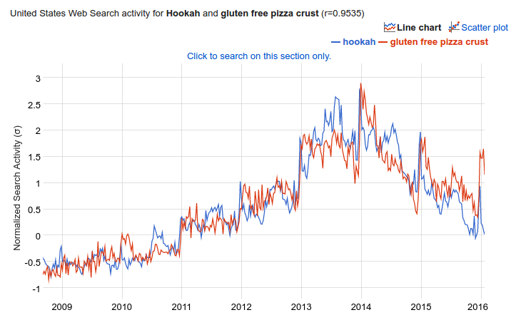
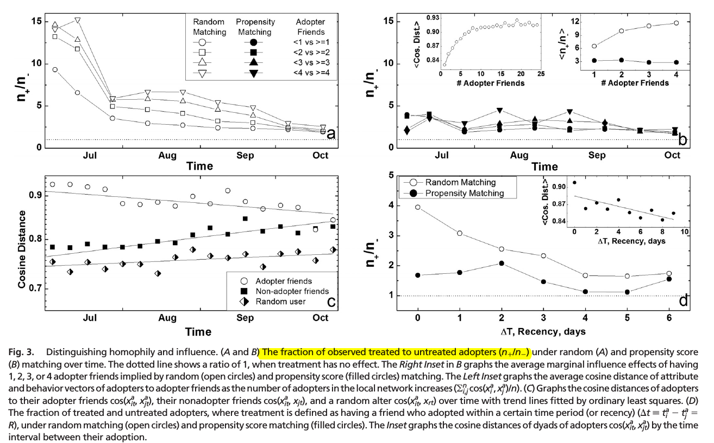

## Context: Identifying Contagion in Networks {.smaller}

*   Ideally we would like to run a model in the form of 
    $$
    Y_i = f\left(X_i, Y_{-i}, G\right)
    $$
    
    where $Y_{-i}$ is the behavior of individuals other than $i$ and $G$ is
    a graph.
    
*   The problem: So far, traditional statistical models won't work, why?
    because most of them rely on having IID. e.g
    
    1.  In OLS $\varepsilon_i$ must be IID, otherwise $E[X\varepsilon]\neq 0$
    2.  In MLE (logit, probit, Survival analysis, etc.) must have IID
        in order to build the likelihood, otherwise will be optimizing a
        wrong log-likelihood.
        
    In both cases, contagion estimators will be biased. 
    
    
## Spatial Autocorrelation Models (SAR) {.smaller}

*   Spatial Autocorrelation Models are mostly applied in the context of spatial
    statistics and econometrics.
    
*   The core part of these model lies on specifying a grid and thus generating
    a network. Such network is then represented as an adjancency matrix with
    row sums equal to 1.
    
*   The spatial autocorrelation model explicitly builds the autocorrelatation of
    a graph (a network) as follows
    
    $$
    \begin{align}
    Y = & \alpha + \rho W Y + X\beta + \varepsilon,\quad\varepsilon\sim MVN(0,\sigma^2I_n) \\
    \implies & Y = \left(I_n -\rho W\right)^{-1}(\alpha + X\beta + \varepsilon)
    \end{align}
    $$

    Where $\rho\in[-1,1]$ and $W=\{w_{ij}\}$, with $\sum_j w_{ij} = 1$

## Spatial Autocorrelation Models (SAR) (cont.) {.smaller}

*   This is more close than we might think, since the $i$-th element of $Wy$ can be
    expressed as $\frac{\sum_j a_{ij} y_j}{\sum_j a_{ij}}$, what we usually
    define as exposure in networks, where $a_{ij}$ is an element of the $\{0,1\}$-adjacency
    matrix .
    
*   Notice that $(I_n - \rho W)^{-1} = I_n - \rho W - \rho^2 W^2 - \dots$, hence
    there autocorrelation does consider effects over neighbors farther than 1 step
    away, which makes the specification of $W$ no critical. (See LeSage, 2008)
    
*   There are several ways of estimating this (besides of the one in the R package
    sna), CRAN has an especial task dedicated to it. (https://cran.r-project.org/web/views/Spatial.html)
    
*   Neat, but this is not problem free... __These models assume that $W$ is exogenous,
    in other words, if there's homophily you won't be able to use it!__
    
*   This takes us to the next method

## General overview {.smaller}

*   __Problem__ Homophily can be confounded with contagion

*   Generically, if we observe homophily in a network, there is a set of variables
    $Z_i$ that partly generated the graph $G$.
    
*   Furthermore, that same variable $Z_i$ may have generated the behavior $Y_i$,
    hence, if we project $Y_i$ onto $G$ (regression model or other model using
    exposure) we will see an association between the two of them.
    
*   Such association will be __spurious__ since comes throught $Z_i$, and is not a
    direct effect of $G$ over $Y$. (See Shalizi and Thomas, 2011)
    
*   __Solution__ (according to Aral et al., 2009) Use propensity score matching,
    to rule out homophily-based contagion. First, lets take a look at the
    Rubin Causal Model.


## How Spurious Correlation Looks like

But before...

```{r, echo =FALSE, out.width="700px", fig.align='center'}

```

<font size="3">Source: Google Correlate https://www.google.com/trends/correlate/search?e=Hookah&e=gluten+free+pizza+crust&t=weekly&p=us&filter=Hookah#default,60</font>


## Rubin Causal Model (1978) {.smaller}

*   __Potential outcomes__ $Y_i(0), Y_i(1)$ are the possible states of the world, this is, the outcome
    of the variable $Y$ for the treated and untreated version of $i$. But we only
    observe one.
    
    $$
    Y_i = Y_i(W_i) = Y_i(1)W_i + Y_i(0)(1-W_i)
    $$
    
*   __Assignment mechanism__ On what depends the treatment regime?
    
    1.  Completely random (ideal case)
    2.  Observable characteristics (we might do something)
    3.  On the outcome (don't even think about it)
    
    Here we see $W_i\perp (Y_i(0),Y_i(1))\;|\;X_i$ (the second case), and refer
    to this as "Unconfounded assignment".
    
*   __Stable Unit Treatment Value Assumption (SUTVA)__ "Joe's change in blood
    pressure may not depend on whether or not Mary receives the drug" [(wiki)](https://en.wikipedia.org/wiki/Rubin_causal_model#An_extended_example)
    
    "Only the level of the treatment applied to the specific individual is
    assumed to potentially affect outcomes for that particular individual"
    (Imbens and Wooldridge 2009, p.13)

    
    
## Rosenbaum and Rubin (1983b) {.smaller}

Assumptions:

1.  __Unconfoundedness__ $W_i \perp (Y_i(0), Y_i(1))\;|X_i$ "Beyond $X_i$, there
    are no (unbserved) characteristics of the individual associated both with the
    potential outcomes and treatment."
    
2.  __Overlap__ $0 < pr(W_i=1|X_i=x) < 1,\;\forall x$ "The conditional distribution
    of $X_i$ given $W_i=0$ completely overlaps the conditional distribution of
    $X_i$ given $W_i=1$." In other words, all estimated probabilities are strictly
    between 0 and 1.
    
    __Unconfoundedness+Overlap__ = __Strong Ignorability__

## Rosenbaum and Rubin (1983b) (cont.) {.smaller}

Usually, we would like to estimate the Average Treatment Effect ($ATE$)

$$
\begin{align}
ATE(x) &= E[Y_i(1) - Y_i(0)| X_i = x] \quad \mbox{(Which we can't estimate)}\\\\
& \mbox{From Unconfoundedness we have} \\
        &= E[Y_i(1) | W_i = 1, X_i = x] - E[Y_i(0) | W_i = 0, X_i = x] \\\\
& \mbox{From  overlap we get} \\
        &= E[Y_i | W_i = 1, X_i = x] - E[Y_i | W_i = 0, X_i = x] \\
\end{align}
$$

Which is something that we can estimate

## Propensity score

*   The propensity score, $p(X_i) = \Pr\{W_i=1|X_i=x\}$, is the conditional probability
    of $i$ receiving the treatment
    
*   Using propensity score we can avoid some issues that arise whe using matching
    methods such as, number of neighbors, or weights to consider, instead we work
    under the following assumption

    $$
    W_i \perp (Y_i(0), Y_i(1))\;|X_i\implies W_i \perp (Y_i(0), Y_i(1))\;|p(X_i)
    $$

*   We just need to estimate the propensity score.

## Nearest Neighbor Matching Estimator {.smaller}

1.  Roughly, for each individual $i$, we find a set $\mathcal{J}_M(i) \subset \{1,\dots,N\}$
    of $M$ nearest neighbors such that all $j\in \mathcal{J}_M(i)$ minimize $\|X_i - X_j\|$ 
    and $W_i \neq W_j$ (so we match on the opposite group).
    
    This $\|X_i - X_j\|$  can be $|\hat p(X_i) - \hat p(X_j)|$ as well, and
    further, with $M=1$.
    
2.  Then, for each individual $i$ we generate the following
    
    $$
    \begin{align}
    \hat Y_i(0) & = Y_i\times1\{W_i=0\} + \left(\frac{1}{M}\sum_{j\in\mathcal{J}_M(i)}Y_j\right)\times 1\{W_i = 1\}  \\
    \hat Y_i(1) & = Y_i\times1\{W_i=1\} + \left(\frac{1}{M}\sum_{j\in\mathcal{J}_M(i)}Y_j\right)\times 1\{W_i = 0\}  \\
    \end{align}
    $$
    
3.  Then we estimate the $ATE = \frac{1}{N}\sum_{i=1}^N\left(\hat Y_i(1) - \hat Y_i(0)\right)$

## Regression including propensity score {.smaller}

In a world where observations are statistically independent, Imbens and Wooldridge
(2009) suggest estimating the following model

$$
\begin{align}
&\min_{\alpha_0,\beta_0}\sum_{i:W_i=0}\frac{(Y_i - \alpha_0 - \beta_0'(X_i - \bar X))^2}{\hat p(X_i)}\\
\tag{20} \mbox{and} &\\ 
&\min_{\alpha_1,\beta_1}\sum_{i:W_i=1}\frac{(Y_i - \alpha_1 - \beta_1'(X_i - \bar X))^2}{1 - \hat p(X_i)}
\end{align}
$$

*   Which can be done in the following steps:

    1.  For the entire dataset, estimate propensity score $\hat p(X_i)$,
    2.  For each group, estimate parameters $\alpha,\beta$.
    3.  The ATE will be then $\tau_{PATE} = \alpha_1 - \alpha_0$


*   They highlight the fact that "[E]ven if the logit
    model for the propensity score is misspecified, the binary response MLE [...]
    still has a well-defined probaiblity limit" (Imbens and Wooldridge, 2009, p.39)
    Leading to consistent estimates.

## Network exposure

*   Network exposure at time $E_t\equiv\{e_{it}\}$ is defined as follows
    
    $$
    e_{it} \equiv \frac{\sum_i a_{ijt}f(\mathbf{x}_{it}, \mathbf{x}_{jt})z_{jt}}{
    \sum_i a_{ijt}f(\mathbf{x}_{it}, \mathbf{x}_{jt})}
    $$
    
    where $a_{ijt}$ is the $ij$-th element of the adjacency matrix at time $t$,
    $f(\mathbf{x}_{it}, \mathbf{x}_{jt})$ is a scalar, and $z_{jt}$ equals 1 if and only if $j$ had
    adopted at time $t$.
    
*   Notice that, in the case of binary networks, when $f(\cdot) = 1$ and we don't normalize, the exposure corresponds
    to number of neighbors that had adopted, which is what the authors used in 
    their paper.

## Context of Aral et al. (2009)

*   27.4 million Yahoo! (IM) users
*   Online behavior as well individuals characteristics.
*   Behavior adoption: Yahoo! Go
*   Previous results over estimated peer influence in this network by
    300%-700%, and homophily explains >50% of the perceived behavioral contagion.

## Multiple treatments: Aral et al. (2009)

*   While we don't observe a particular "exposed/not exposed" treatment variable,
    we can generate such using a threshold.
    
*   In the paper, for each time period $j$, for each level of exposure $j$, they
    define $W_{ijt} = 1\{e_{it}\geq j\}$ ($T_{it}$ in their notation). Hence, for
    example, if $e_{it}=3$ (# of friends who adopted at time $t$) and $j=2$, then
    $T_{it} = 1$.
    
*   In the paper they have
    $\left(\mbox{Exposure levels}\right)\times\left(\mbox{Time points}\right)$
    treatments.
    
*   They did applied the same method using time windows instead (not discussed
    here).
    
## Implementation {.smaller}

1.  __Probability of treatment__ They use logit model to estimate propensity scores

    $$
    p_{lt}(X_{it}) = \Pr\{W_{ilt} = 1|X_{it}\} = \frac{\exp(\alpha_{lt} + \beta_{lt}X_{it})}{1 + \exp(\alpha_{lt} + \beta_{lt}X_{it})}
    $$

2.  __Removing outliers__ For each individual $i$ in the set of treated they found a match
    $j$ by solving the following problem
    $j = \arg\min_{j: W_{ilt}\neq W_{jlt}} |p_{lt}(X_i) -  p_{lt}(X_j) |$
    
    subject to $|p_{lt}(X_i) -  p_{lt}(X_j) |\leq 2\sigma_d$, where
    $\sigma_d = \sqrt{\hat V(|p_{lt}(X_i) -  p_{lt}(X_j) |)}$

3.  __Pseudo treatment effect__ Then, out of the entire set of matches, they
    counted the number of individuals who had adopted the behavior $n_+$ and who
    had not $n_-$ and computed the ratio.
    
    
One important point. The authors do not discuss another important assumption that takes
place in the Rubin Causal Model. The _Stable Unit Treatment Value Assumption_ (SUTVA) states that the treatment effects have no spill overs (Sekhon 2007). This can be assumed in the dynamic part of the model arguying that any spill overs happend with time lags and thus won't affect the outcomes at the current time.


## Results

```{r, echo=FALSE, out.width="900px", fig.align='center'}

```


## References {.smaller}
    
*   Aral, S., Muchnik, L., & Sundararajan, A. (2009). Distinguishing influence-based contagion from homophily-driven diffusion in dynamic networks. Proceedings of the National Academy of Sciences of the United States of America, 106(51), 21544–21549. http://doi.org/10.1073/pnas.0908800106

*   Imbens, G. W., & Wooldridge, J. M. (2009). Recent Developments in the Econometrics of Program Evaluation. Journal of Economic Literature, 47(1), 5–86. http://doi.org/10.1257/jel.47.1.5

*   Sekhon, J. S. (2008). The Neyman-Rubin Model of Causal Inference and Estimation Via Matching Methods. The Oxford Handbook of Political Methodology. http://doi.org/10.1093/oxfordhb/9780199286546.003.0011

*   Wooldridge, J. M. (2010). Econometric Analysis of Cross Section and Panel Data (2nd ed.). Cambridge: MIT Press.

*   LeSage, J. P. (2008). An Introduction to Spatial Econometrics. Revue D’économie Industrielle, 123(123), 19–44. http://doi.org/10.4000/rei.3887
