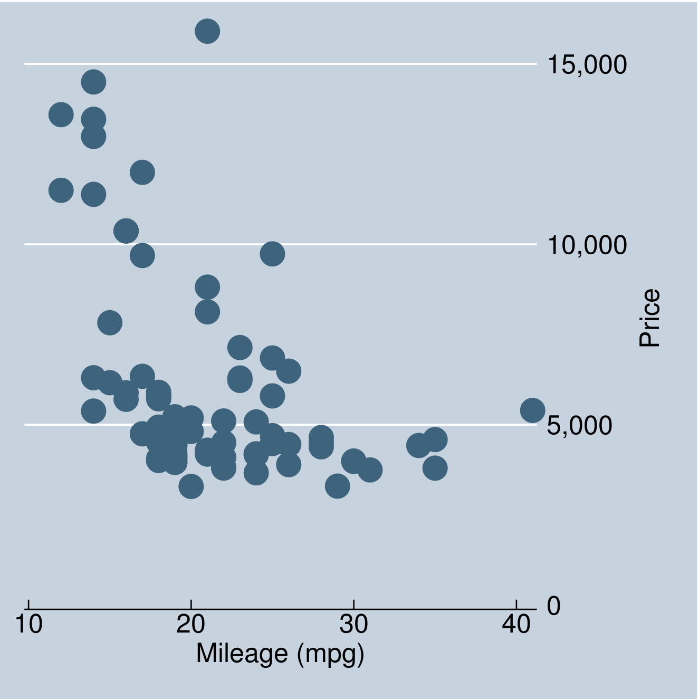

```{r setup, include=FALSE}
knitr::opts_chunk$set(echo = FALSE, autodep = TRUE)
```

# Some background

## Reproducible Research

> "The term reproducible research refers to the idea that the ultimate product
> of academic research is the paper along with the __full computational environment
> used to produce the results in the paper such as the code, data, etc.__ that
> can be used to reproduce the results and __create new work based on the research__"

\raggedleft 

[Wiki](https://en.wikipedia.org/wiki/Reproducibility#Reproducible_research)

## Reproducible Research (cont. I)

```{r, echo=FALSE, out.width="500px", fig.align='center', fig.cap='How does reproducible research looks like. Credit: Joe Sutliff/www.cdad.com/joe'}

```


## Reproducible Research (cont. II) {.smaller}

-   A major new issue in sciences (overall):
    * Accessible Reproducible Research ([Mesirov, __Science__ 2010](http://science.sciencemag.org/content/327/5964/415))
    * Again, and Again, and Again, ... ([Jasny et al., __Science__ 2011](http://science.sciencemag.org/content/334/6060/1225))
    * Challenges in Irreproducible Research ([__nature__ topic](http://www.nature.com/news/reproducibility-1.17552))
-   Not far away from social sciences...
    *   "Estimating the reproducibility of psychological science" ([Nosek and a bunch more, __Science__ 2015](http://science.sciencemag.org/content/349/6251/aac4716)]):
        -   Replicating results from 100 papers from 3 top psychology journals
        -   39% of replications obtained statistically significant results (reached the same conclusions than original papers).
        -   Mean effect size of original papers ~0.4, and ~0.2 on replications

-------

```{r, echo=FALSE, out.width="600px", fig.cap="Original study effect size versus replication effect size (correlation coefficients). Fig 3. in Nosek et al. (Science 2015)", fig.align='center'}
knitr::include_graphics("nosek.jpg")
```


## Not a new thing actually {.smaller}


> __Literate programming__ [published in 1983] is an approach to programming
> introduced by Donald Knuth in which a
> program is given as an explanation of the program logic in a natural language,
> such as English, interspersed with snippets of macros and traditional source
> code, from which a compilable source code can be generated

[Wiki](https://en.wikipedia.org/wiki/Literate_programming)

> __TeX__ is a typesetting system (or "formatting system") designed and mostly
> written by Donald Knuth  and released in 1978 [MS Word didn't showed up until the 
> 90'] [...] TeX was designed with two main goals in mind: to allow anybody to
> produce high-quality books using minimal effort, and to provide a system that
> would give exactly the same results on all computers, at any point in time

[Wiki](https://en.wikipedia.org/wiki/TeX)

## How to 'Reproducible Research'

- What you can do:
    * Provide __raw__ data (raw, i.e. before "cleaning it"),
    * Provide source code (what ever programming environment you are using) for reproducing:
  _cleaned data_, models, tables, figures, etc.
    * Hopefully have a neat way of coding your programs: Inline Comments, Indentation of control-flow statements (for, while, case, switch, ifelse, etc.)
- What else
    * Try using version control software (such as git) to make your research "opensource"
    * Avoid using proprietary software (hopefully always)


# Hands on Reproducible Research

## Some more background

-   __LaTeX__ Nice typesetting, nice references manager, high quality figures (PostScript, PDF),
    pretty (and complex) equations, you can even draw pictures!
    (see [here](http://www.texample.net/tikz/examples/scenario-tree/)).
-   __PostScript__ "[I]s a computer language for creating vector graphics."
    ([wiki](https://en.wikipedia.org/wiki/PostScript))
-   __markdown__ "[A] lightweight markup language with plain text formatting syntax
    designed so that it can be converted to HTML and many other formats"
    ([wiki](https://en.wikipedia.org/wiki/Markdown))
-   __Pandoc__ "[I]s a free and open-source software document converter, widely
    used as a writing tool (especially by scholars)" ([wiki](https://en.wikipedia.org/wiki/Pandoc))

## Tools {.smaller}

A couple of tips

- R
    * Try using [knitr](https://cran.r-project.org/web/packages/knitr/index.html) and [Rmarkdown](https://cran.r-project.org/web/packages/rmarkdown/index.html)
    * [texreg](https://cran.r-project.org/web/packages/texreg/index.html) for fancy regression tables.
    * Checkout `?grDevices::Devices`.
    * More resources at CRAN task View [Reproducible Research](https://cran.r-project.org/web/views/ReproducibleResearch.html)
- Stata
    * Some useful commands: [outreg2](https://ideas.repec.org/c/boc/bocode/s456416.html), [estout](http://repec.org/bocode/e/estout/index.html), 
    * Checkout `h graph export` command with pdf/eps formats.
    * You can write TeX/Markdown documents in Stata (see [here](http://www.stata.com/meeting/italy14/abstracts/materials/it14_haghish.pdf))
    * More resources at [UCLA's idre](http://www.ats.ucla.edu/stat/stata/latex/)


## Example 1: Reg-like tables in Stata {.smaller}

-   We use the `outreg2` command (`ssc install outreg2`)
-   Can generate regression/summary tables in various formats:
    LaTeX, Word (rtf), Excel (xml, xls, xlm, or cvs), Plain (txt), and Stata (dta).
-   Here is an example:

```{stata stata-outreg}
qui sysuse auto
outreg2 using mystatatab.tex, replace text word: ///
  qui reg price rep78 i.foreign mpg
outreg2 using mystatatab.tex, append text word: ///
  qui reg price rep78 mpg
outreg2 using mystatatab.tex, append text word: ///
  qui reg price rep78 i.foreign
```


---- 

We can read it in R!

```{r stata-tab, comment="", echo=TRUE, size="small"}
read.delim("mystatatab.txt", sep = "\t", header = FALSE)
```

## Example 2: Plots in stata {.smaller}

Creating a graph and exporting it as EPS (Encapsulated PostScript). High res image that can be used in LaTeX and Word =).

\footnotesize
```{stata stata-scatter}
qui sysuse auto
scatter price mpg, scheme(economist)
graph export mystataplot.eps, replace
```

```{bash, cache=FALSE, echo=FALSE}
epstopdf --res 600 mystataplot.eps && pdftocairo -r 600 -png mystataplot.pdf mystataplot
```


```{r, echo=FALSE, out.width="300px", fig.align='center',fig.cap="A neat Stata plot"}

```

\begin{figure}
\includegraphics[width=.5\linewidth]{mystataplot.eps}
\caption{A scatter plot from stata using ``The Economist'' scheme}
\end{figure}


## Example 3: Regression tables in R {.smaller}

<!-- From stata -->

\footnotesize
```{stata saveauto, echo=FALSE, cache=TRUE, results='hide'}
sysuse auto
save auto.dta, replace
```
\normalsize

<!-- Now, in R -->

\footnotesize
```{r lm, echo=TRUE}
auto <- foreign::read.dta("auto.dta")
ans1 <- lm(price~rep78+factor(foreign)+mpg, auto)
ans2 <- lm(price~rep78+mpg, auto)
ans3 <- lm(price~rep78+factor(foreign), auto)
```

<!-- \begin{table} -->
<!-- \scriptsize -->
```{r texreg, results='asis', echo=TRUE, message=FALSE}
# texreg::texreg(list(ans1, ans2, ans3), table=FALSE) # if you want to use LaTeX
texreg::htmlreg(list(ans1, ans2, ans3), table=FALSE)
```
<!-- \normalsize -->
<!-- \caption{A regression table with different specifications (R)} -->
<!-- \end{table} -->

## Example 4: Plots in R

\footnotesize
```{r rscatter, echo=TRUE, out.width='400px', fig.width=6, fig.height=4, fig.cap="A neat plot in R", fig.align='center'}
cols <- auto$rep78
cols[is.na(cols)] <- 0
vran <- range(cols, na.rm = TRUE)
cols <- (cols-vran[1])/(vran[2] - vran[1])
cols <- rgb(colorRamp(blues9)(cols), maxColorValue = 255)
plot(price~mpg, auto, pch=19, col=cols)
```

## Some Refs. on Reproducible Research {.smaller}

*   __JAMA__ On the "Statistical Analysis Subsection"
    
    > "[I]nclude the statistical software used to perform the analysis, including
    > the version and manufacturer, along with any extension packages [...]""
    > (see [here](http://jama.jamanetwork.com/public/instructionsForAuthors.aspx#ManuscriptChecklist))

*   __Prevention Science__ On the "Ethical Responsibilities of Authors"

    > "Upon request authors should be prepared to send relevant documentation or
    > data in order to verify the validity of the results. This could be in the form
    > of raw data, samples, records, etc."
    > (see [here](http://www.springer.com/cda/content/document/cda_downloaddocument/SPR+Prevention+Science+-+IFAs+-+2015+SL.pdf?SGWID=0-0-45-1514983-p35521857))

*   __Health Psychology__ On "Computer Code"

    > "We request that runnable source code be included as supplemental material
    > to the article"

*   __Annals of Behavioral Medicine__ On "Ethical Responsibilities of Authors"

    > "Upon request authors should be prepared to send relevant documentation or
    > data in order to verify the validity of the results. This could be in the
    > form of raw data, samples, records, etc."
    > (see [here](http://www.springer.com/medicine/journal/12160?detailsPage=pltci_2363800))

## Some Pub. Hints {.smaller}

|Journal| Accepts LaTeX | EPS figures |
|:------|:-------------:|------------:|
JAMA    | no :(         | yes
Prevention Science| yes | yes
Health Psychology | yes*| yes
Annals of Behavioral Medicine | ? | ?
American Journal of Public Health | no? | yes

(*) Accepts PDFs.


## How to 'Reproducible Research' (again)

- What you can do:
    * DO Provide __raw__ data (raw, i.e. before "cleaning it"),
    * DO Provide source code (what ever programming environment you are using) for reproducing:
  _cleaned data_, models, tables, figures, etc.
    * ~~Hopefully~~ DO have a neat way of coding your programs: Inline Comments, Indentation of control-flow statements (for, while, case, switch, ifelse, etc.)
- What else
    * Try using version control software (such as git) to make your research "opensource"
    * Avoid using proprietary software (hopefully always)
    
    
# Questions?

<p align='center'>
<font size=14>Thanks!</font><br><br>
George G. Vega Yon<br>
vegayon@usc.edu<br><br>
www.its.caltech.edu/~gvegayon
</p>